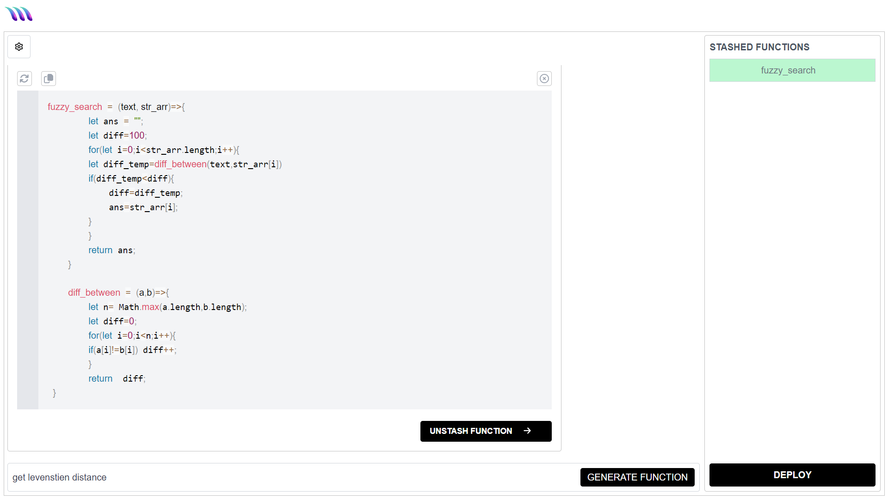
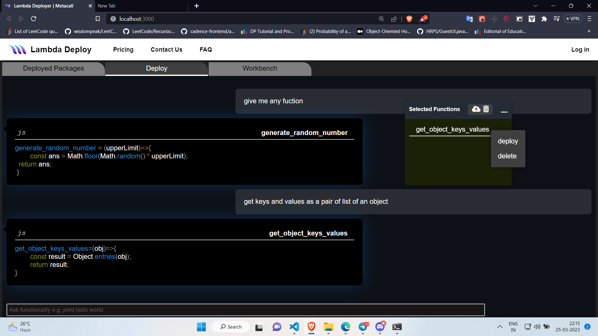

# MetaCall GPT Deploy

Metacall GPT Deploy allows to intelligently deploy lambda function and provides playground for MetaCall with assistance of ChatGPT. Try it yourself: [https://gpt.dashboard.metacall.io](https://gpt.dashboard.metacall.io)

## How to start the application

```sh
npm run start
```

## How to build the application

```sh
npm run build
```

## How to deploy the application

```sh
npm run deploy
```

## Showcase




